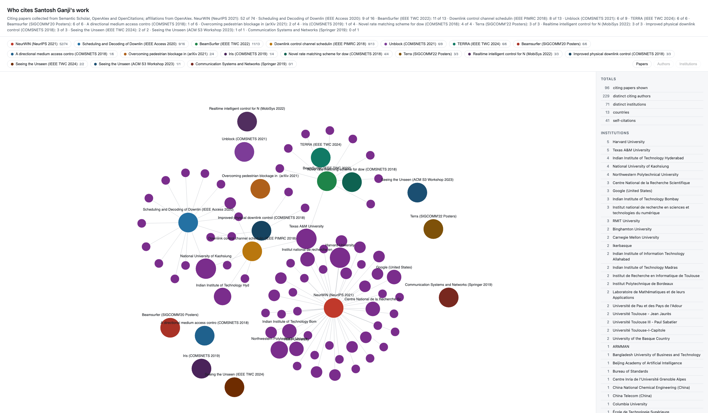
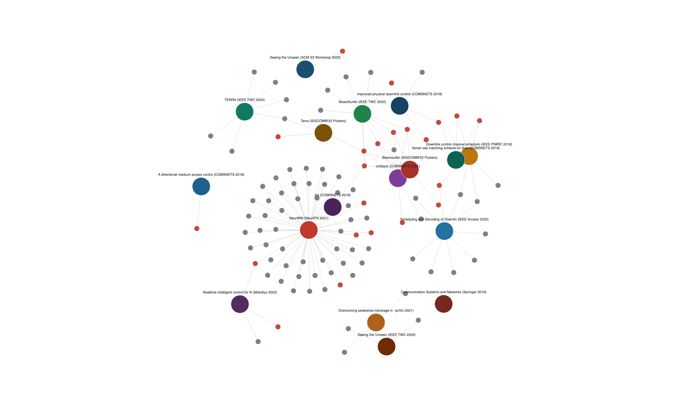
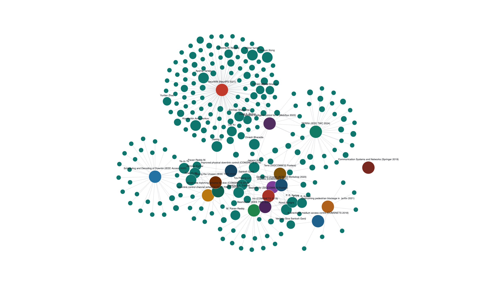

# scholar-citation-map

See who builds on your work.

Google Scholar shows a citation count. This shows the people behind the count.
Which labs read your papers. Which institutions. Which countries. How many cite
you independently of your own co-authors.

**[See it running](https://shotsan.github.io/scholar-citation-map/)**


## What it answers

- Which institutions cite your work, and how often.
- How many researchers cite you independently. Self-citations are separated, not dropped.
- Which countries your work has reached.
- Which groups already read you, so you know who to approach.
- Which reviewers are conflicted, because they cite you or co-authored with you.

## Three steps

### 1. List your papers

One title per line. Copy them off your Scholar profile.

```
NeurWIN: Neural Whittle index network for restless bandits via deep RL
BeamSurfer: Minimalist beam management of mobile mm-wave devices
```

Venue and Scholar count may follow a `|`. Both are optional. They only feed the
coverage check.

```
NeurWIN: Neural Whittle index network for restless bandits | NeurIPS 2021 | 74
```

### 2. Run one command

```
pip install -r requirements.txt
export CITATION_MAP_EMAIL=you@example.com

python3 scripts/run.py --titles my_papers.txt --name "Your Name" --images
```

No API keys are needed. Allow about twenty seconds per paper. A 20-paper profile
takes around ten minutes. The script prints each stage as it goes.

### 3. Open the page

`citation_map.html` opens in any browser and works offline. Drag to pan. Scroll
to zoom. Switch between papers, authors and institutions.



`--images` also writes a PNG of each view, sized for slides and posters.

<table>
<tr>
<td width="50%"><a href="docs/assets/map_papers.png"></a><br><b>Papers</b> — every citing paper, self-citations in red</td>
<td width="50%"><a href="docs/assets/map_authors.png"></a><br><b>Authors</b> — sized by how many of your papers they cite</td>
</tr>
</table>

## What you get

| Path | Contents |
|---|---|
| `citation_map.html` | the interactive page, self-contained and offline |
| `images/` | a PNG per view, for slides and posters |
| `tables/` | four CSVs: citing papers, authors, institutions, countries |
| `graphs/` | PNG, plus GraphML and GEXF for Gephi or Cytoscape |
| `data/` | the raw API responses and the cleaned records |

`tables/citing_authors.csv` is the one to read first. One row per person, how
many of your papers they cite, their institution, and whether they are a
co-author.

## Where you would use it

**Tenure and promotion.** A citation count says how much. A named list of
institutions says how far. Self-citations are separated, so the independent
figure holds up to scrutiny.

**Grants and fellowships.** Panels ask about uptake. The country and institution
tables answer that in one figure.

**Job market.** One map in a research statement shows who picked the work up.
The same image works on a talk slide.

**Collaborators and reviewers.** The author table names the groups already
reading you. It also flags who is conflicted as a reviewer.

## Where the data comes from

Google Scholar will not serve its own "Cited by" pages. A CAPTCHA sits in front
of them. So four open APIs stand in: Semantic Scholar, OpenAlex, OpenCitations
and Crossref.


Every row records the source it came from. The build reports collected against
Scholar for each paper, so the gap stays visible.

## What it will not tell you

- Coverage runs below Scholar's count. Theses, workshop papers and non-English
  venues are thinly indexed by these APIs.
- Patents are not covered. No bibliographic API indexes them.
- Affiliations are patchier than the paper list. OpenAlex often stores none for
  IEEE conference records and arXiv preprints.
- Names merge on surname and first initial. Two authors sharing both count once.

The [guide](docs/GUIDE.md#known-limits) sets out each one and how to work around it.

## The worked example

[`examples/ganji/`](examples/ganji/) holds a full run on one Scholar profile: the
input file, the raw API responses, and every output.

| | |
|---:|---|
| **96** | citing papers, 41 of them self-citations |
| **229** | citing authors, 210 outside the co-author group |
| **71** | institutions across 13 countries |
| **118** | rows collected, against Scholar's 192 |

## More

The [guide](docs/GUIDE.md) covers target resolution, rate limits, and running the
five scripts separately when you want the stages.

```
scripts/          the pipeline, with run.py as the one-command entry point
docs/             the site, the guide and the images above
examples/ganji/   a full worked run
```
