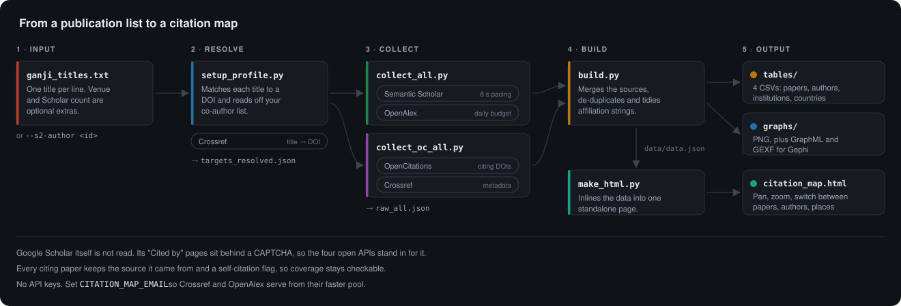
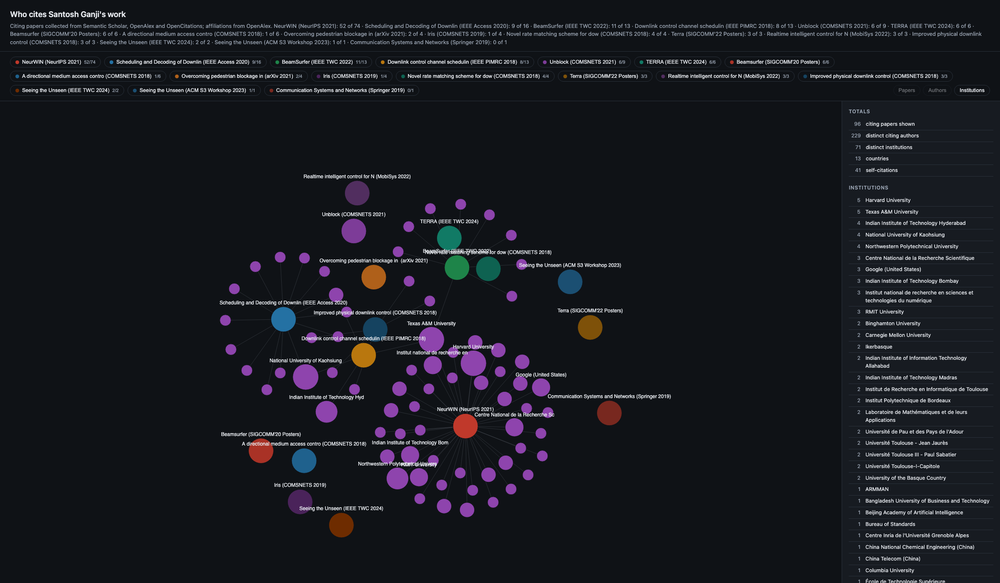
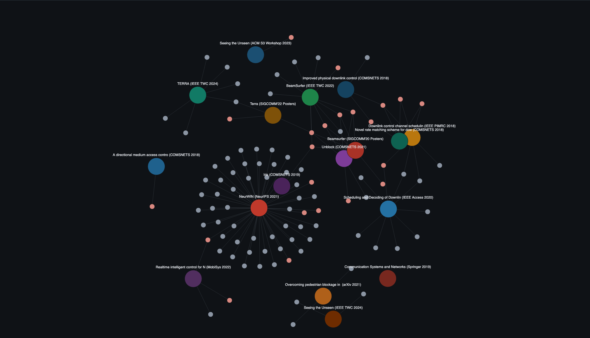
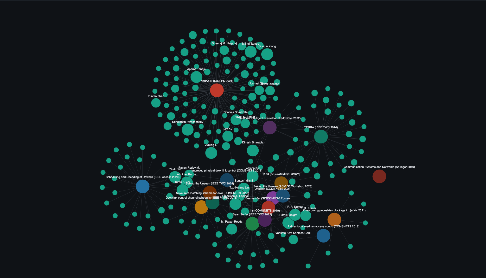

# scholar-citation-map

Find out who cites a researcher's work — the citing papers, the authors who
wrote them, and the institutions behind those authors. Produces four CSVs,
citation graphs, and one interactive page that opens offline.

**[Open the live map](https://shotsan.github.io/scholar-citation-map/)**



## The map

Three views of the same data. Each chip is one of your publications; click it to
drop that publication from the graph. Hover any node for its record.



<table>
<tr>
<td width="50%"><a href="docs/assets/map_papers.png"></a><br><b>Papers</b> — each citing paper, self-citations in pink</td>
<td width="50%"><a href="docs/assets/map_authors.png"></a><br><b>Authors</b> — node size grows with papers cited</td>
</tr>
</table>

## The worked example

[`examples/ganji/`](examples/ganji/) covers one Google Scholar profile,
20 entries and 192 citations.

| | |
|---:|---|
| **96** | distinct citing papers, 41 of them self-citations |
| **229** | citing authors, 210 outside the co-author group |
| **71** | institutions across 13 countries |
| **118** | rows collected against Scholar's 192 citations |

Top external citing authors: Milind Tambe (10 papers), Konstantin Avrachenkov
(7), Aparna Taneja (6). Top institutions: Harvard and Texas A&M at 5 each.

Google Scholar's own "Cited by" pages sit behind a CAPTCHA, so the citing records
come from Semantic Scholar, OpenAlex, OpenCitations and Crossref instead. Every
row carries the source it came from, and the build reports collected against
Scholar per paper, so the gap stays visible.

## Running it

```
pip install -r requirements.txt
export CITATION_MAP_EMAIL=you@example.com

mkdir -p ~/my-citations && cd ~/my-citations
# one title per line, copied from the Scholar profile
python3 /path/to/scripts/setup_profile.py --titles my_papers.txt
python3 /path/to/scripts/collect_all.py
python3 /path/to/scripts/collect_oc_all.py
python3 /path/to/scripts/build.py --raw raw_all.json --out-dir . --title "My publications"
python3 /path/to/scripts/make_html.py --data data/data.json --out citation_map.html
```

No API keys. Roughly twenty seconds per publication, so a 20-paper profile takes
about ten minutes. A Semantic Scholar author id works in place of a titles file.

The [guide](docs/GUIDE.md) covers target resolution, rate limits and every
script.

## What lands on disk

| Path | Contents |
|---|---|
| `tables/` | four CSVs: citing papers, authors, institutions, countries |
| `graphs/` | PNG, plus GraphML and GEXF for Gephi or Cytoscape |
| `citation_map.html` | the interactive page, self-contained and offline |
| `data/` | raw API responses and the cleaned records |

## Limits

- Coverage runs below Scholar's counts. Theses, workshop papers and non-English
  venues are thinly indexed by these APIs.
- Patents are not covered. No bibliographic API indexes them.
- Affiliations are patchier than the paper list. OpenAlex often stores none for
  IEEE conference records and arXiv preprints.
- Author names merge on surname plus first initial, so two distinct authors
  sharing both would be counted once.

The [guide](docs/GUIDE.md#known-limits) sets out each one and how to work around
it.

## Repository layout

```
scripts/            the pipeline
scripts/legacy/     earlier scripts, kept so the example stays reproducible
docs/               the site, the guide and the images above
examples/ganji/     a worked example: input, data, tables, graphs, web pages
```
